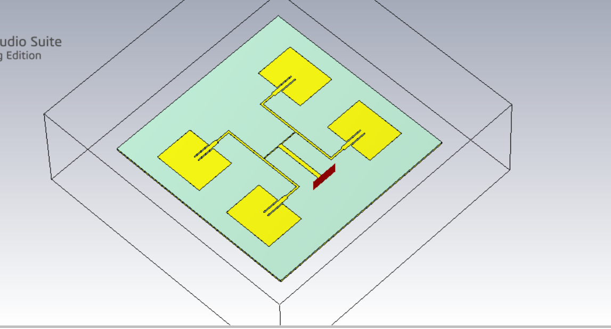
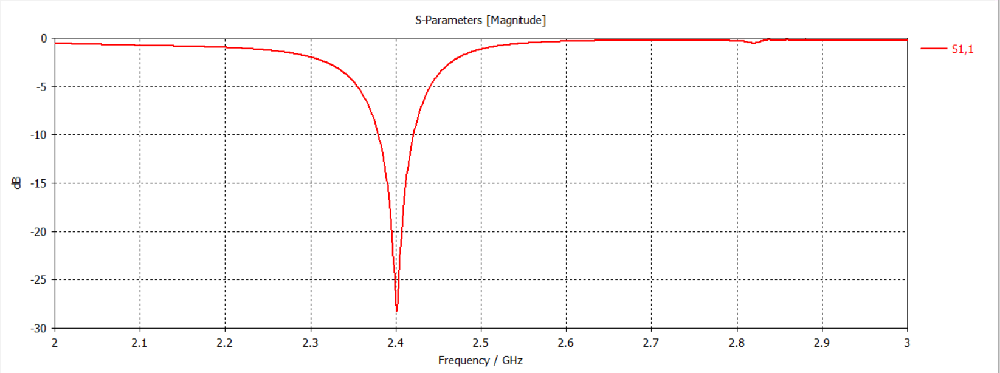
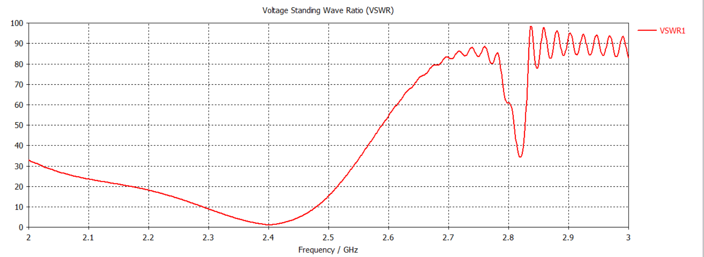
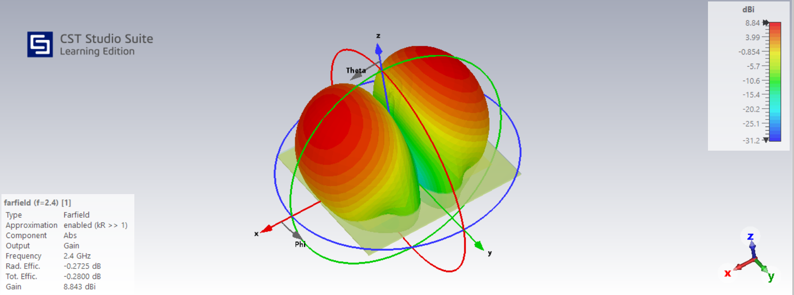
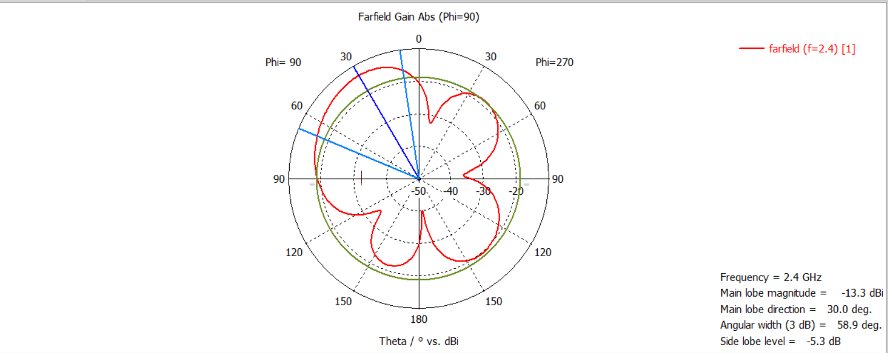
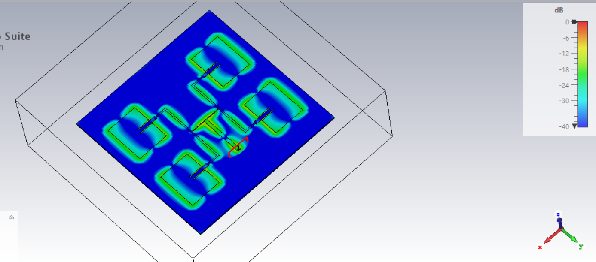

# 2x2-Microstrip-Patch-Antenna-Array-2.4GHz
Design and CST simulation of a 2×2 microstrip patch antenna array operating at 2.4 GHz, including S11, VSWR, far-field radiation pattern, gain, and surface electric-field analysis.
# 2×2 Microstrip Patch Antenna Array for 2.4 GHz

A 2×2 microstrip patch antenna array designed and simulated using CST Studio Suite for operation around 2.4 GHz.

The project demonstrates the design, simulation, and analysis of a four-element microstrip patch antenna array, including impedance matching, VSWR, far-field radiation characteristics, gain, and electric-field distribution.

---

## Overview

Microstrip patch antenna arrays are widely used in wireless communication systems where higher gain and improved radiation characteristics are required compared with a single patch antenna.

In this project, four rectangular microstrip patch elements are arranged in a 2×2 configuration and excited through a corporate-style feed network.

The antenna was designed for operation around the **2.4 GHz ISM band** and simulated using **CST Studio Suite Learning Edition**.

---

## Objectives

- Design a 2×2 microstrip patch antenna array.
- Target operation around 2.4 GHz.
- Develop a suitable feeding network for the four patch elements.
- Analyze the input reflection coefficient (S11).
- Evaluate the Voltage Standing Wave Ratio (VSWR).
- Analyze the far-field radiation pattern.
- Determine the antenna gain and radiation characteristics.
- Observe the electric-field distribution on the antenna structure.

---

## Antenna Structure

The antenna consists of:

- Four rectangular microstrip patch elements
- Microstrip transmission-line feed network
- Dielectric substrate
- Conducting ground plane
- Single input excitation port

### Antenna Geometry

---

## Simulation Software

**Software:** CST Studio Suite Learning Edition

**Simulation frequency:** 2.4 GHz

**Antenna type:** 2×2 Microstrip Patch Antenna Array

---

## Results

### 1. S11 Parameter

The simulated reflection coefficient shows a strong resonance around **2.4 GHz**.

The minimum simulated S11 is approximately **−28 dB**, indicating good impedance matching at the resonant frequency.

---

### 2. VSWR

The simulated VSWR reaches a minimum close to **1** around 2.4 GHz.

A VSWR close to 1 indicates that most of the input power is delivered to the antenna rather than being reflected back toward the source.

---

### 3. 3D Far-Field Radiation Pattern

The simulated 3D far-field pattern at 2.4 GHz shows the directional radiation characteristics of the antenna array.

The simulated maximum gain is approximately **8.84 dBi**.

---

### 4. 2D Radiation Pattern

The 2D far-field radiation pattern provides a cross-sectional view of the radiation characteristics of the antenna at 2.4 GHz.

---

### 5. Electric Field Distribution

The electric-field distribution illustrates the field excitation and concentration around the four patch elements and their feeding network.

---

## Key Results

| Parameter | Simulated Result |
|---|---:|
| Operating frequency | ~2.4 GHz |
| Number of elements | 4 |
| Array configuration | 2×2 |
| Minimum S11 | ~−28 dB |
| Minimum VSWR | ~1 |
| Maximum gain | ~8.84 dBi |

---

## Design Concept

The four patch elements are arranged in a 2×2 configuration to increase the effective aperture of the antenna and improve its gain compared with a single patch element.

A microstrip feed network is used to distribute the input signal to the four patches.

The antenna response is evaluated through electromagnetic simulation by examining:

1. Input impedance matching
2. Reflection coefficient
3. VSWR
4. Radiation pattern
5. Far-field gain
6. Electric-field distribution

---

## Applications

A 2.4 GHz microstrip patch antenna array can be relevant to wireless communication systems operating in the 2.4 GHz ISM band, including:

- Wi-Fi systems
- WLAN applications
- IoT devices
- Short-range wireless communication
- 2.4 GHz RF systems

---

## Project Images

### Antenna Structure

### S11

### VSWR

### 3D Far-Field

### 2D Radiation Pattern

### Electric Field

---

## Future Improvements

Possible improvements to the design include:

- Optimization of patch dimensions
- Optimization of element spacing
- Improvement of impedance matching
- Reduction of side-lobe levels
- Optimization of the feed network
- Parametric analysis of important antenna dimensions
- Comparison with a single patch antenna
- Fabrication and experimental validation

---

## Tools Used

- CST Studio Suite
- Electromagnetic simulation
- Microstrip antenna design
- S-parameter analysis
- Far-field analysis

---

## Author

**Arya**

Electronics and Communication Engineering

---

## License

This project is intended for educational and academic purposes.
